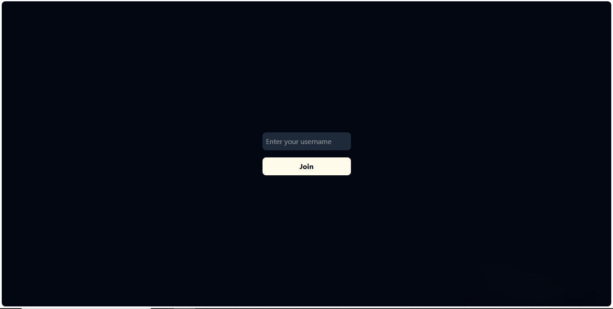
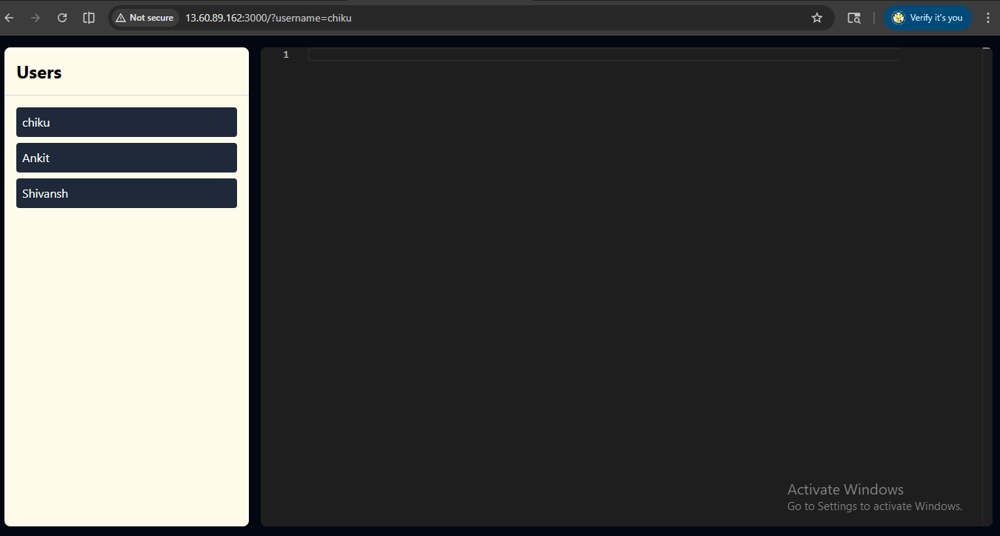
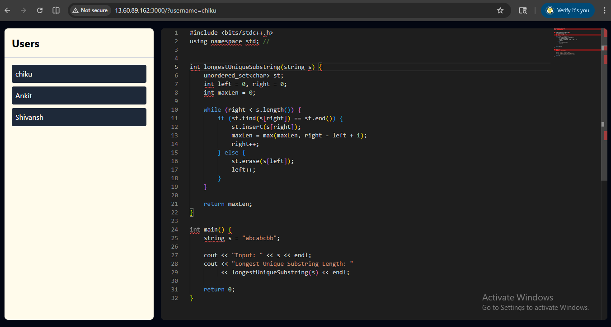
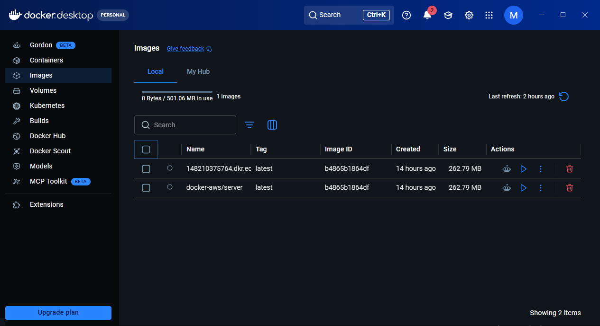
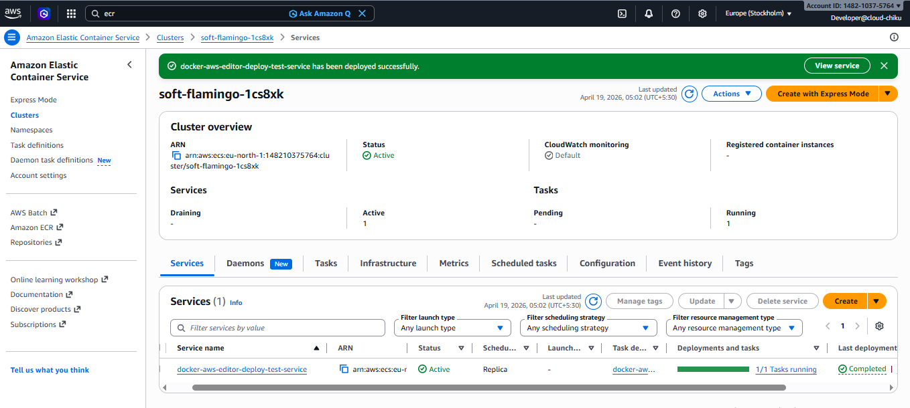
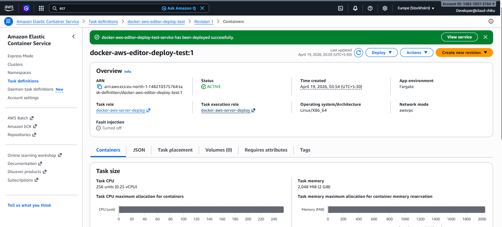
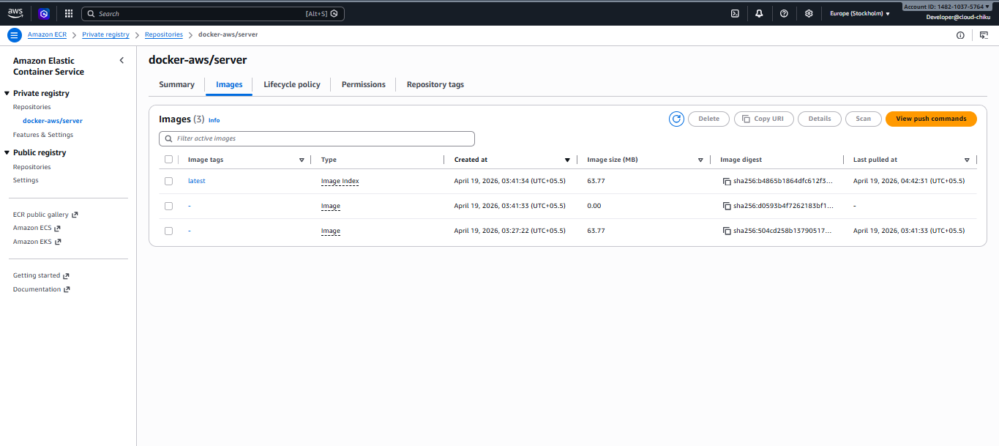

#  Collaborative Code Editor

> **Code Together. In Real-Time.**

-----
##  Problem Statement

Real-time collaborative systems are difficult to design due to challenges in **state synchronization, concurrent updates, and conflict resolution** across multiple clients.

In naive implementations, simultaneous edits often result in:

* Overwritten data
* Inconsistent client states
* Increased synchronization latency

Ensuring **low-latency, conflict-free, and strongly consistent updates** across distributed users requires a robust synchronization strategy.

---

##  Solution Approach

This project implements a **real-time collaborative code editor** using a combination of:

* **WebSockets (Socket.io)** for persistent, low-latency communication
* **CRDT (Y.js)** for conflict-free, distributed state synchronization
* **Room-based session isolation** for controlled multi-user collaboration
* **Docker** for environment consistency and portability
* **AWS ECS + ECR** for containerized cloud deployment and orchestration

This architecture guarantees that all connected clients maintain a **consistent shared state in real time**, without manual conflict resolution.


---
## Application Interface ( Code Editor )

<!-- Add your app screenshot here -->

---

## Connected Users ( Real-Time )


---

## Live Collaborative Code Editor ( Multi-User )



---

##  System Architecture

### 🔹 Runtime Architecture (Application Flow)

```
Client (Browser)
     ↓
React + Monaco Editor (Frontend UI)
     ↓
WebSocket Connection (Socket.io)
     ↓
Node.js Backend (Express Server)
     ↓
CRDT Sync Engine (Y.js)
```

### 🔹 Explanation

* The **client (browser)** connects to the backend using a persistent WebSocket connection
* All code changes are transmitted instantly via **Socket.io**
* The backend processes updates using **Y.js (CRDT)** to ensure conflict-free synchronization
* Changes are broadcast to all connected clients in the same session (room)

This ensures **real-time, consistent, and distributed state synchronization** across users.

---

### 🔹 Deployment Architecture (Cloud Flow)

```
Local Docker Image
        ↓
Push to AWS ECR (Image Registry)
        ↓
ECS Task Definition (Container Config)
        ↓
ECS Cluster (Compute Layer)
        ↓
Running Container (Application Instance)
```

### 🔹 Explanation

* The application is containerized using Docker
* Docker image is pushed to **Amazon ECR**
* ECS pulls the image and runs it as a **task inside a cluster**
* The container serves the application in a managed environment

This setup provides **scalability, portability, and production-like deployment behavior**.


---
## Dockerized Backend & Image Registry ( Local )


---
## ECS Running Task ( Container Active )

---

## Production Deployment on AWS ECS ( Fargate )


---


## Container Configuration Via ECS Task Definition Deploy


---

## Image Push TO Amazon ECR ( Container Registry )




## 

##  Tech Stack

###  Frontend

<p align="left">
  
  
  
  
  
  
  
</p>

---

###  Backend

<p align="left">
  
  
  
  
</p>

---

###  DevOps

<p align="left">
  
  
</p>

---

## Key Features

###  🔹 Real-Time Collaborative Editing

Seamlessly enables multiple users to write and edit code **simultaneously**, with instant updates reflected across all connected clients.

---

### 🔹 Conflict-Free Synchronization (CRDT Powered)

Utilizes **Y.js (CRDT)** to ensure that concurrent edits are merged automatically without data loss or manual conflict resolution.

---

### 🔹 Session-Based Collaboration (Room System)

Supports isolated collaboration spaces where users can join specific rooms and work together in a controlled environment.

---

### 🔹 Low-Latency Communication

Implements **WebSocket-based communication (Socket.io)** to maintain persistent connections and deliver updates in real time.

---

### 🔹 Fully Containerized Application

The entire system is packaged using **Docker**, ensuring consistency across development and deployment environments.

---

### 🔹 Cloud-Native Deployment (AWS ECS)

Deployed using **Amazon ECS with ECR**, demonstrating container orchestration and scalable cloud deployment practices.

---

### 🔹 Scalable & Stateless Backend Design

Backend services are designed to be **stateless**, allowing easy horizontal scaling in container-based environments.

---
##  What I Learned

* Understood how the **Docker → ECR → ECS flow** actually works in a real deployment
* Got clarity on how **ECS tasks, services, and clusters** are connected in practice
* Learned why backend services should be **stateless** for better scalability
* Worked with **WebSockets** to handle real-time communication between multiple users
* Explored how **Y.js (CRDT)** helps manage shared state without conflicts

---

##  Challenges I Faced

* Handling **real-time updates** when multiple users were editing at the same time
* Understanding how **Y.js works internally** and integrating it properly
* Fixing **WebSocket connection issues** while running inside Docker
* Managing Docker setup for both frontend and backend without breaking things
* Figuring out the **ECS deployment flow**, especially task setup and container execution
---

##  Getting Started

Want to run this project on your system? Follow the steps below 👇

---

## Run Locally (Development Mode)

###  1. Clone the Repository

```bash
git clone https://github.com/your-username/your-repo.git
cd your-repo
```

---

###  2. Setup Backend

```bash
cd backend
npm install
```

Create a `.env` file inside `backend/`:

```env
PORT=3000
CLIENT_URL=http://localhost:5173
```

Start backend:

```bash
npm run dev
```

---

###  3. Setup Frontend

Open a new terminal:

```bash
cd frontend
npm install
npm run dev
```

---

###  4. Access the App

* Frontend → http://localhost:5173
* Backend → http://localhost:3000

---

##  Run with Docker (Quick Setup)

###  1. Build Image

```bash
docker build -t collaborative-editor .
```

---

###  2. Run Container

```bash
docker run -p 3000:3000 collaborative-editor
```

---

###  3. Open in Browser

http://localhost:3000

---

##  Prerequisites

Make sure you have installed:

* Node.js (v18+)
* npm (v8+)
* Docker

---

##  Notes

* Start backend before frontend
* Make sure ports 3000 & 5173 are free
* Docker setup runs the app independently (no local setup needed)
---
##  About the Developer

<div align="center">

<h3><b>SATYAM</b></h3>

<p>
 Cloud & DevOps Enthusiast <br/>
 Building Real-Time Systems & Scalable Cloud Architectures <br/>
Focused on AWS • Docker • Distributed Systems
</p>

<br/>

<a href="https://github.com/your-username">
  
</a>

<a href="https://linkedin.com/in/your-profile">
  
</a>

</div>

---
