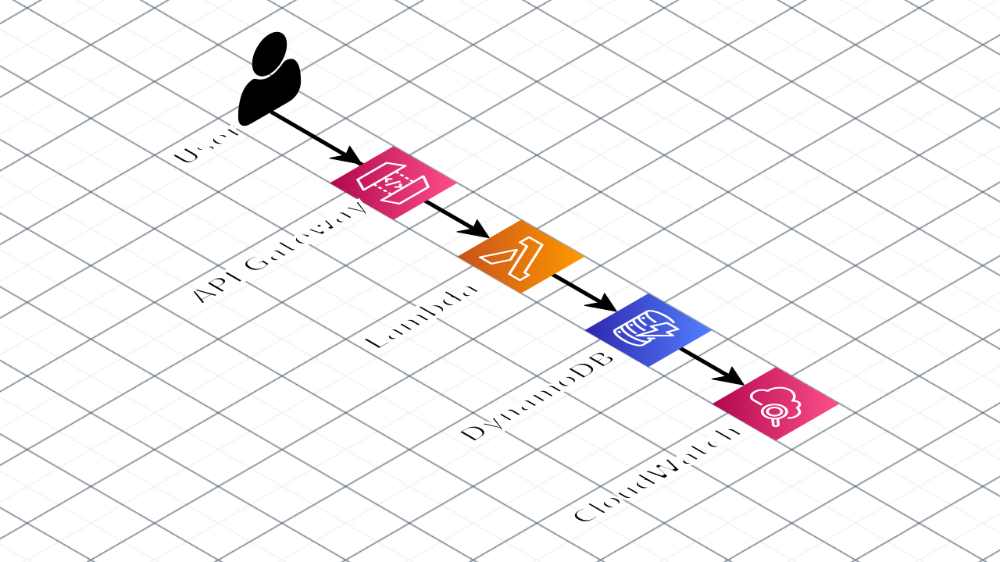
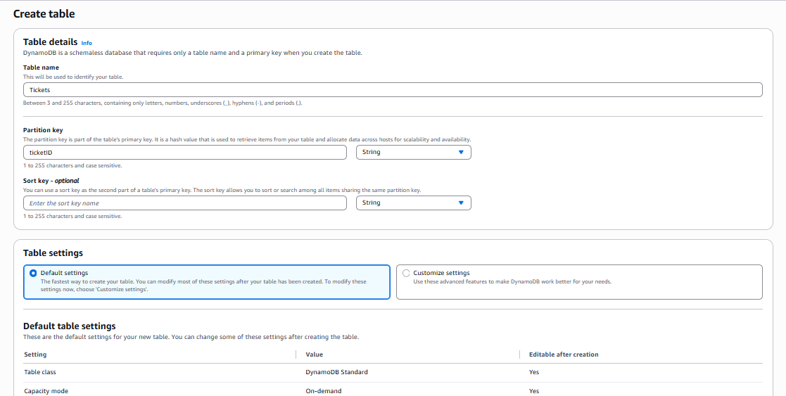
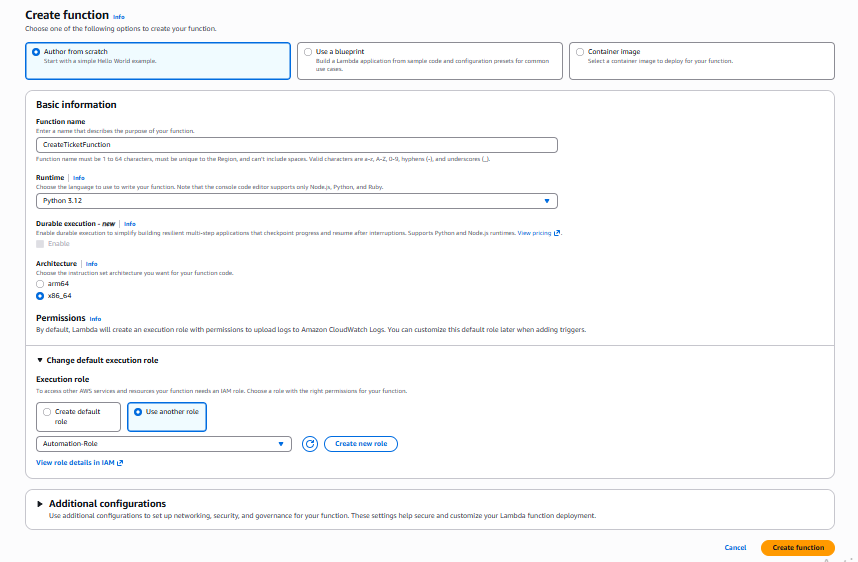
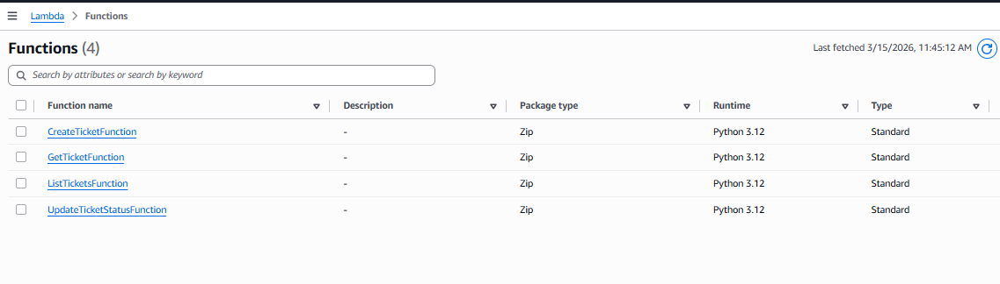
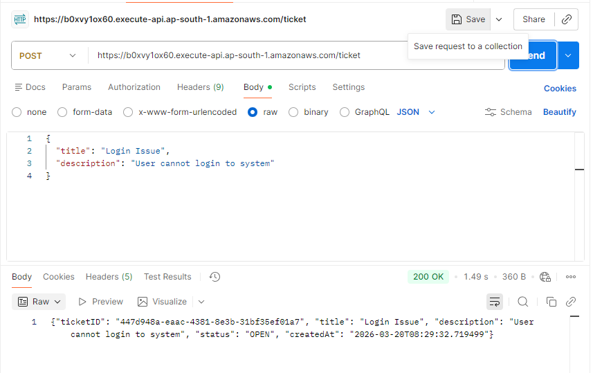
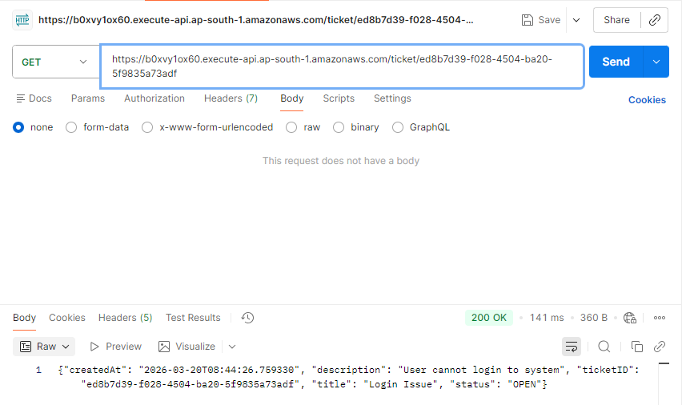
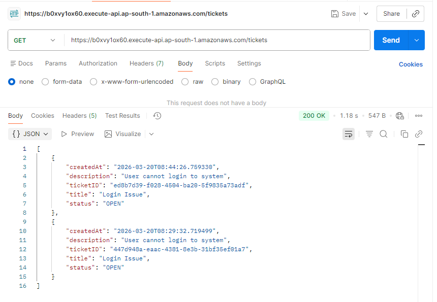
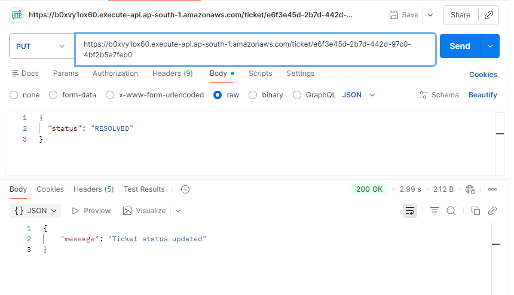
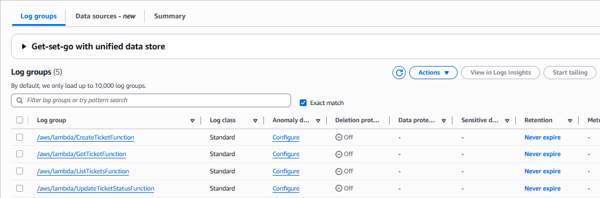

# Serverless Ticket Platform — Version 1

A beginner-friendly guide to build a **Serverless Ticket Management Backend** using AWS.

This version demonstrates how to deploy a basic serverless backend where users can:

- Create tickets
- Retrieve ticket details
- List all tickets
- Update ticket status

The system is built entirely using AWS serverless services.

---

## Table of Contents

- [Architecture Overview](#architecture-overview)
- [Architecture Diagram](#architecture-diagram)
- [AWS Services Used](#aws-services-used)
- [Prerequisites](#prerequisites)
- [Step 1 — Create DynamoDB Table](#step-1--create-dynamodb-table)
- [Step 2 — Create IAM Role](#step-2--create-iam-role-for-lambda)
- [Step 3 — Create Lambda Functions](#step-3--create-lambda-functions)
- [Step 4 — Create API Gateway](#step-4--create-api-gateway)
- [Step 5 — Test API Endpoints](#step-5--test-api-endpoints)
- [Step 6 — View CloudWatch Logs](#step-6--view-cloudwatch-logs)
- [Step 7 — Check Troubleshooting](#troubleshooting)
- [Version 1 Complete](#version-1-complete)

---

# Architecture Overview

The Version-1 system follows a simple serverless architecture.

This project follows a serverless architecture built using AWS services. 
User requests are sent to API Gateway, which acts as the public entry point for the system. 
API Gateway routes the request to the appropriate AWS Lambda function that contains the backend logic. 
The Lambda functions interact with a DynamoDB table to store and retrieve ticket data. 
All execution logs and monitoring information are automatically captured in CloudWatch. 
This design removes the need to manage servers while providing a scalable and event-driven backend.

---
# Architecture Diagram





---

# AWS Services Used

| Service | Purpose |
|------|------|
| API Gateway | Exposes HTTP API endpoints |
| Lambda | Executes backend logic |
| DynamoDB | Stores ticket data |
| IAM | Manages permissions |
| CloudWatch | Logs and monitoring |

---

# Prerequisites

Before starting, make sure you have:

- An active AWS account
- Access to the AWS Management Console
- Basic knowledge of AWS services
- Postman or curl for API testing

---

# Step 1 — Create DynamoDB Table

First we create a database to store ticket data.

1. Open the AWS Console.
2. Search for **DynamoDB**.
3. Open the DynamoDB service.
4. Click **Create table**.

Configure the table:



```
Table name--> Tickets
```

```
Partition key--> ticketID
```

````
Key type--> String
````

Leave all other settings as default.

Click **Create table**.

Wait until the table status becomes **Active**.

---

# Step 2 — Create IAM Role for Lambda

Lambda needs permission to access DynamoDB and write logs.

1. Open AWS Console.
2. Search for **IAM**.
3. Open the IAM service.
4. Click **Roles**.
5. Click **Create role**.

Select:


Click **Next**.

Add the following permissions policies:

```
AmazonDynamoDBFullAccess
```

```
CloudWatchLogsFullAccess
```

Click **Next**.

Role name:

```
TicketLambdaRole
```

After this, your screen should look like the following:


Click **Create role**.


---

# Step 3 — Create Lambda Functions

Now create the backend logic using Lambda.

1. Open **AWS Console**.
2. Search **Lambda**.
3. Open the **Lambda** service.
4. Click **Create function**.

Choose **Author from scratch**.

Fill in the following details:



Function name  
```
CreateTicketFunction
```

Runtime  
```
Python 3.12
```

Execution role  
```
Use existing role → TicketLambdaRole
```

Click **Create function**.

Repeat the same process to create three additional functions:

```
GetTicketFunction
ListTicketsFunction
UpdateTicketStatusFunction
```

After this step, you should have **four Lambda functions**.



### Lambda Function Code 

Each Lambda function in this project has its corresponding Python implementation stored in this repository.

When creating the Lambda functions in AWS Console, copy the code from the following files and paste it into the appropriate Lambda function.

---
### 1. CreateTicketFunction

Handles creation of a new ticket and stores it in the DynamoDB table.

Code file:

[CreateTicketFunction](../V1.14.3.26/Lambda-Function/CreateTicketFunction.py)
---

---
### 2. Get Ticket Function

Retrieves a specific ticket using the ticket ID provided in the API request.

Code file:

[GetTicketFunction](../V1.14.3.26/Lambda-Function/GetTicketFunction.py)
---

---
### 3. List Tickets Function

Retrieves all tickets stored in the DynamoDB table.

Code file:

[ListTicketsFunction](../V1.14.3.26/Lambda-Function/ListTicketsFunction.py)
---

---
### 4. Update Ticket Status Function

Updates the status of an existing ticket.

Code file:

[UpdateTicketStatusFunction](../V1.14.3.26/Lambda-Function/UpdateTicketStatusFunction.py)
---

# Step 4 — Create API Gateway

Now create an API that connects users to Lambda functions.

1. Open the **AWS Console**.
2. Search **API Gateway**.
3. Click **Create API**.
4. Select **HTTP API**.

API name:

```
TicketAPI
```

Add integrations for the following Lambda functions:

```
CreateTicketFunction
GetTicketFunction
ListTicketsFunction
UpdateTicketStatusFunction
```

you should see all routes configured under a single API Gateway:


Create the following routes:

| Method | Endpoint | Lambda Function |
|------|------|------|
| POST | /ticket | CreateTicketFunction |
| GET | /ticket/{id} | GetTicketFunction |
| GET | /tickets | ListTicketsFunction |
| PUT | /ticket/{id} | UpdateTicketStatusFunction |

After this, your screen should look like the following:


Click **Create API**.

After the API is created, AWS will provide an **Invoke URL**.

Example:

```
https://abc123.execute-api.region.amazonaws.com
```


---

# Step 5 — Test API Endpoints

You can test the API using **Postman** or **curl**.

### Create Ticket

Request:

```
POST  https://abc123.execute-api.region.amazonaws.com/ticket
```

Body:

```
{
  "title": "Login Issue",
  "description": "Cannot login"
}
```

Expected Response:





---

### Get Ticket

```
GET https://abc123.execute-api.region.amazonaws.com/ticket/ed8b7d39-f028-4504-ba20-5f9835a73adf
```

Returns ticket details.



---

### List Tickets

```
GET https://abc123.execute-api.region.amazonaws.com/tickets
```

Returns all stored tickets.



---

### Update Ticket Status

```
PUT /ticket/e6f3e45d-2b7d-442d-97c0-4bf2b5e7feb0
```

Body:

```
{
  "status": "RESOLVED"
}
```


---
# Step 6 — View CloudWatch Logs

CloudWatch logs help debug Lambda execution.

1. Open the **AWS Console**.
2. Search **CloudWatch**.
3. Go to:

```
Logs → Log groups
```

4. Select the Lambda log group.

Example:

```
/aws/lambda/CreateTicketFunction
```



You will see:

- Lambda execution logs
- API request logs
- Error messages

---

# Troubleshooting

If your API is not working as expected, check the following common issues.


## 1. Lambda Environment Variable

Each Lambda function must have the following environment variable configured.

Go to:

Lambda → Your Function → Configuration → Environment variables

Add:

```
Key: TABLE_NAME
Value: Tickets
```

Why this is required:

All Lambda functions read the DynamoDB table name using this environment variable.  
If this is missing or incorrect, the function will fail with an error.

---

## 2. DynamoDB Table Configuration

Make sure your DynamoDB table is created correctly.

Required configuration:

Table name

```
Tickets
```

Partition key

```
ticketID
```

Key type

```
String
```

Important:

- The table name must exactly match the value used in `TABLE_NAME`
- The partition key must be `ticketID`
- If the key name or type is different, API requests will fail

---

## 3. IAM Role Permissions

Ensure your Lambda execution role has the required permissions.

Required policies:

```
AmazonDynamoDBFullAccess
CloudWatchLogsFullAccess
```

Without these permissions:

- Lambda cannot read/write data
- Logs will not appear in CloudWatch

---

## 4. API Gateway Route Configuration

Make sure your routes are configured correctly.

```
POST /ticket
GET /ticket/{id}
GET /tickets
PUT /ticket/{id}
```

Important:

The `{id}` parameter is required for GET and PUT requests.  
If the route is incorrect, Lambda will not receive the correct input.

---

## 5. Check CloudWatch Logs

If something is not working, always check logs.

Go to:

```
CloudWatch → Logs → Log groups
```

Open your Lambda log group:

```
/aws/lambda/CreateTicketFunction
```

Look for:

- Error messages
- Missing parameters
- Permission issues

---

## Common Errors

Missing TABLE_NAME  
→ Lambda will throw environment variable error

Wrong table name  
→ ResourceNotFoundException

Wrong key name  
→ ValidationException

Permission issue  
→ AccessDeniedException

---

## Final Tip

Always test APIs step-by-step:

1. Create ticket  
2. Get ticket  
3. List tickets  
4. Update ticket  

This helps quickly identify where the issue is.


---

# Version 1 Complete

After completing all steps, you will have built a **Serverless Ticket Backend System**.

Components created:

- API Gateway
- Lambda functions
- DynamoDB database
- IAM role
- CloudWatch logs

Features supported:

- Create tickets
- Retrieve ticket details
- List tickets
- Update ticket status

Version 1 demonstrates the **core serverless architecture for a ticket management system**.
